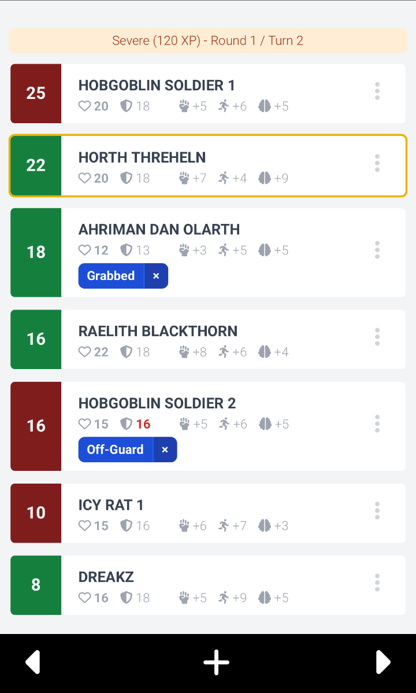
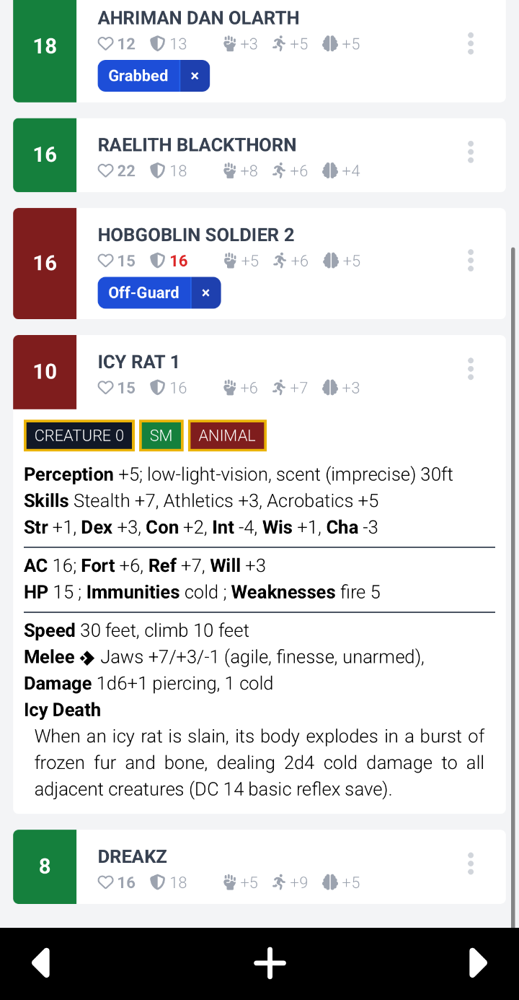
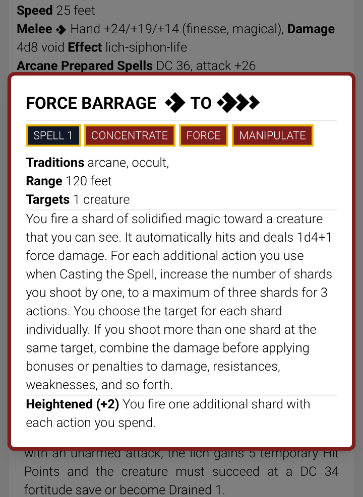
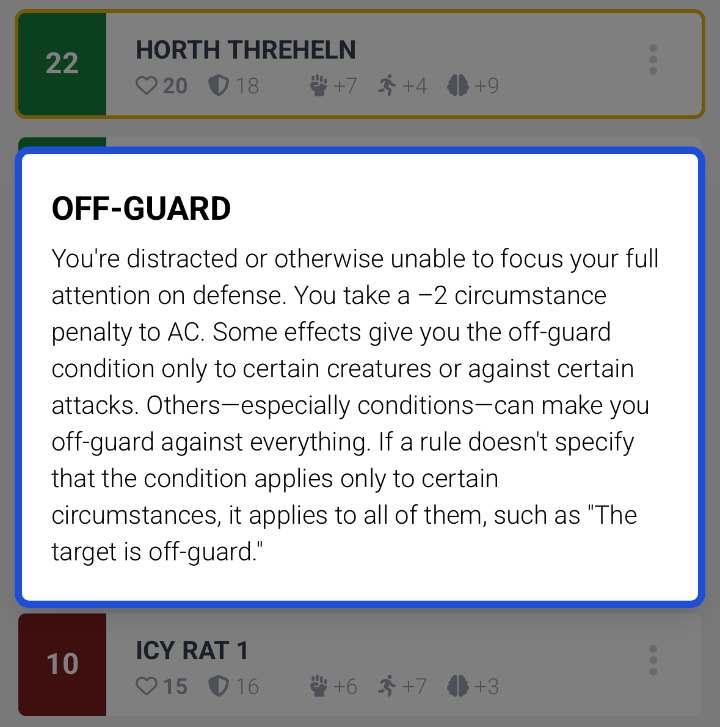

# PF2 Encounterbrew (BETA)

PF2 Encounterbrew is a self-hosted, mobile-browser friendly encounter tracker for the Pathfinder 2 TTRPG system by Paizo Inc.

## Features

### Combat Tracking

<div align="center">
  
  <p><b>Encounter View</b></p>
</div>

- **Initiative Tracking** - Automatic sorting of combatants by initiative order
- **Turn Management** - Navigate between turns with simple previous/next controls
- **Active Turn Highlighting** - Visual indicator shows whose turn it is
- **Bulk Initiative Setting** - Set all initiatives at once or individually
- **Encounter difficulty** -  Calculated automatically based on party level
- **XP Budget Display** - See total XP and budget for balanced encounters
- **Quick Damage/Healing** - Apply damage or healing with mobile friendly controls

### Monster Management

<div align="center">
  
  <p><b>Monster Statblock</b></p>
</div>

- **Full Statblocks** - View complete monster statistics including abilities and attacks
- **Multi Attack Penalty** - See attack bonuses for 3 consecutive attacks pre-calculated. e.g. Jaws +7/+3/-1
- **Extensive Bestiary** - Access to thousands of official Pathfinder 2e creatures
- **Search** - Search monsters by name with instant results
- **Monster Filtering** - Filter by name to find the perfect encounter creatures
- **Multiple Instances** - Add multiple copies of the same monster with automatic numbering

### Spellcards

<div align="center">
  
  <p><b>Spellcard</b></p>
</div>

- **Spellcard** - Click spell in statblock to see card with complete spell info


### Condition Tracking

<div align="center">
  
  <p><b>Condition info</b></p>
</div>

- **Comprehensive Conditions** - All official PF2e conditions available
- **Visual Condition Display** - See active conditions at a glance
- **Easy Application** - Click to add/remove conditions from combatants
- **Condition Descriptions** - Full condition effects available on click
- **Multiple Conditions** - Track multiple conditions per combatant

### Encounter Management
- **Create & Edit Encounters** - Build encounters with custom names and descriptions
- **Party Assignment** - Assign specific parties to encounters for quick player management
- **Quick Combat Setup** - Add monsters and players to encounters with a few clicks
- **Encounter List View** - Manage all your encounters from a centralized dashboard
- **Delete & Modify** - Full CRUD operations for encounter management

### Party Management
- **Create Parties** - Organize your players into reusable party groups
- **Player Management** - Add players with name, level, HP, AC, and perception
- **Quick Player Addition** - Add new players directly from party edit screen
- **Import/Export Parties** - Share parties between campaigns or backup your data
- **Multi-Party Support** - Manage multiple parties for different campaigns

## How do I run this

- Install [Docker](https://www.docker.com/)
- Download the [docker-compose.yml](./docker-compose.yml) file from this repository
- Open a terminal window
- Find the `docker-compose.yml` you just downloaded inside the terminal window (e.g. `cd ~/Downloads`)
- Run the following command:

```shell
docker compose up
```

You should now be able to access the application on [http://localhost:8080](http://localhost:8080)

If you have not changed the default username and password in the `docker-compose.yml` file, your can login with username `gamemaster` and password `changeme123`.

If you are done using the application, you can shut it down with typing `CTRL+C` in the terminal window.

All your encounters, parties and players will be stored inside a database and will still be there once your restart the application.

## Legal & copyright

"PF2 Encounterbrew" uses trademarks and/or copyrights owned by Paizo Inc., used under Paizo's Community Use Policy (paizo.com/communityuse). I am expressly prohibited from charging you to use or access this content. "PF2 Encounterbrew" is not published, endorsed, or specifically approved by Paizo. For more information about Paizo Inc. and Paizo products, visit paizo.com.

Creature data used in this encounter tracker, see `data` folder, is provided by the Pathfinder 2e FoundryVTT team under the Apache 2.0 license.

## FAQ

You got questions? I try to answer the most common ones here: [FAQ.md](./FAQ.md)

## Patch Notes

See [CHANGELOG.md](./CHANGELOG.md)

## Contributing

See [CONTRIBUTING.md](./CONTRIBUTING.md)
